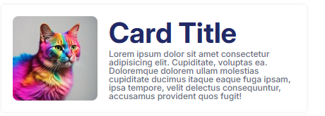
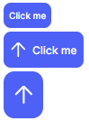

# Design System

## Introdução
Esse repositório foi criado com o intuito de desenvolver um Design System, utilizando como base um protótipo no Figma, disponível [aqui](https://www.figma.com/community/file/1267195373409722424).

## Ferramentas utilizadas
* Styled Components
* React.js 
* Vite
* TypeScript

## Componentes disponíveis

### UI 
#### 1) Card 
* Disponível nas versões horizontal e vertical, o card foi construído para agrupar informações e imagens.

#### 2) Componentes de Tipografia (Typography)
* Criados como versões estilizadas de parágrafos e headings.

#### 3) Button
* Disponível para os tamanhos **giant**, **large**, **medium**, **small** e **tiny**, o componente de botão possui duas variantes principais: **outlined**, que possui um fundo transparente, e **primary**, que possui o fundo correspondente à cor primária. Além disso, o botão foi estilizado para diferentes estados: **hover**, **disabled**, **active** e **focus**.

    

#### 4) Button Group
* Disponível nos mesmos tamanhos de `button`, o componente é responsável por agrupar componentes de botão.

    

